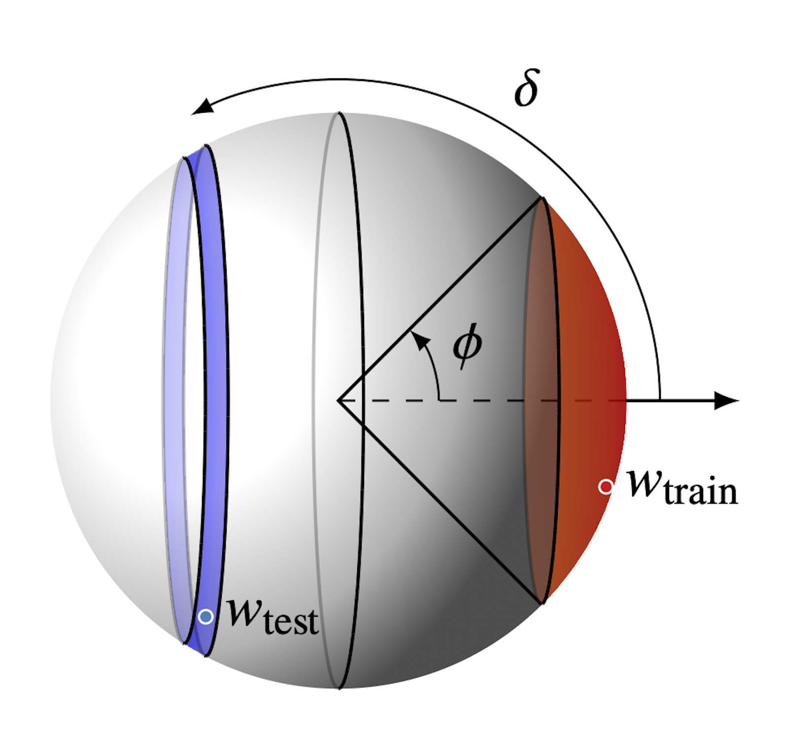

# When can in-context learning generalize out of task distribution?

**Paper (ICML 2025):** [Arxiv](https://arxiv.org/abs/2506.05574), [OpenReview](https://openreview.net/forum?id=YKyza9lrv4)

This repository contains the code for the paper *"When can in-context learning generalize out of task distribution?"*

 

## Citation

If you find this code useful, please consider citing our work:

```tex
@inproceedings{
    goddard2025when,
    title={When can in-context learning generalize out of task distribution?},
    author={Chase Goddard and Lindsay M. Smith and Vudtiwat Ngampruetikorn and David J. Schwab},
    booktitle={Forty-second International Conference on Machine Learning},
    year={2025},
    url={https://openreview.net/forum?id=YKyza9lrv4}
}
```
